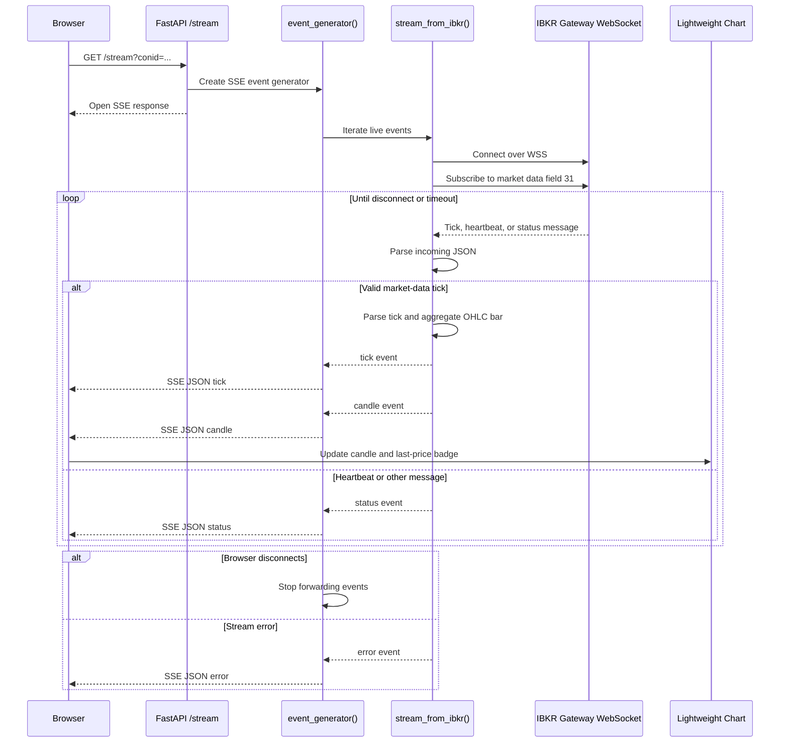

Description: Examples of using Interactive Brokers Web API. Using FastAPI and Lightweight Charts. Think of this as a continuation of [simpler examples](https://github.com/TimIntegration/ibweb), refer to that README.md for instruction on how to run the IB Web API Gateway defined in the Dockerfile.

Instructions:
1. Install dependencies
```
uv venv
source .venv/bin/activate
uv pip install -r requirements.txt
```
2. Start the IB Web API gateway and authenticate on localhost:5000
3. Run the examples
```
uvicorn src.server:app --reload --port 8000
```

Open the dashboard at `http://localhost:8000/`. The FastAPI server uses plain HTTP;
using `https://localhost:8000/` causes Uvicorn to report `Invalid HTTP request received`.

## Live stream sequence

